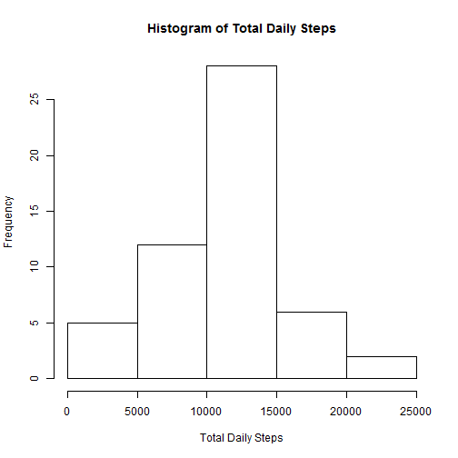
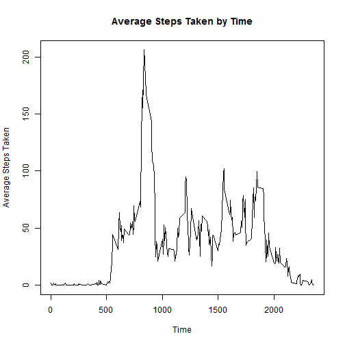
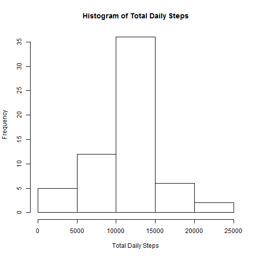
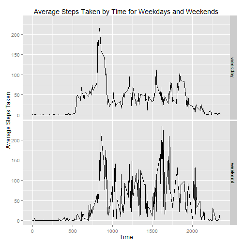

## Loading and preprocessing the data
Unzip the data and read it into an R dataframe:

```r
rawData <- unzip("activity.zip")
data <- read.csv(rawData)
```


## What is mean total number of steps taken per day?
Calculate the total steps per day and plot a histogram of the results:

```r
dailySteps <- aggregate(data$steps, by=list(data$date), FUN=sum)
hist(dailySteps[,2], main = "Histogram of Total Daily Steps", xlab = "Total Daily Steps")
```

 

Calculate the mean and median number of steps taken each day:

```r
mean(dailySteps[,2], na.rm=TRUE)
```

```
## [1] 10766.19
```

```r
median(dailySteps[,2], na.rm=TRUE)
```

```
## [1] 10765
```

## What is the average daily activity pattern?
Calculate and plot the average steps taken by each 5-minute interval:

```r
averageSteps <- aggregate(data$steps, by=list(data$interval), FUN=mean, na.rm = TRUE)
plot(averageSteps[,1], averageSteps[,2], type="l", xlab="Time", ylab="Average Steps Taken", 
  main="Average Steps Taken by Time")
```

 

Find the 5-minute interval with the highest average number of steps:

```r
averageSteps[which.max(averageSteps[,2]),1]
```

```
## [1] 835
```


## Imputing missing values
What is the total number of missing values in the dataset?

```r
sum(is.na(data))
```

```
## [1] 2304
```

Create a new dataset equal to the original dataset but with each of the missing values replaced by the average for that 5-minute interval:

```r
names(averageSteps) <- c("interval","avgsteps")
myData <- merge(data, averageSteps, by.x="interval",by.y="interval")
missingValues <- is.na(myData)[,"steps"]
myData[missingValues,"steps"] <- myData[missingValues,"avgsteps"]
myData <- myData[,c("interval","steps","date")]
```

Calculate the total steps per day with the new data and plot a histogram of the results:

```r
dailySteps1 <- aggregate(myData$steps, by=list(myData$date), FUN=sum)
hist(dailySteps1[,2], main = "Histogram of Total Daily Steps", xlab = "Total Daily Steps")
```

 

Calculate the mean and median number of steps taken each day with the new data:

```r
mean(dailySteps1[,2])
```

```
## [1] 10766.19
```

```r
median(dailySteps1[,2])
```

```
## [1] 10766.19
```

The mean is the same, but the median has risen slightly to be equal to the mean. The histogram frequencies have increased slightly due to more values being considered. In this case, the impact was fairly minimal, but it could have had a larger impact if the calculations or dataset manipulations were performed differently.

## Are there differences in activity patterns between weekdays and weekends?
Create a new factor variable in the modified dataset indicating if the day is a weekday or weekend:

```r
myData[,"daytype"] <- "weekday"
myData[which(weekdays(as.Date(myData[,"date"])) == c("Saturday", "Sunday")), "daytype"] = "weekend"
myData[,"daytype"] <- as.factor(myData[,"daytype"])
```

Calculate and plot the average number of steps taken at each 5-minute interval separated by weekdays and weekends:

```r
averageSplit <- aggregate(myData$steps, by=list(myData$interval, myData$daytype), FUN=mean)
names(averageSplit) <- c("interval","daytype","steps")
qplot(interval, steps, data=averageSplit, facets=daytype ~ ., geom="line", xlab="Time", 
  ylab="Average Steps Taken", main="Average Steps Taken by Time for Weekdays and Weekends")
```

 
